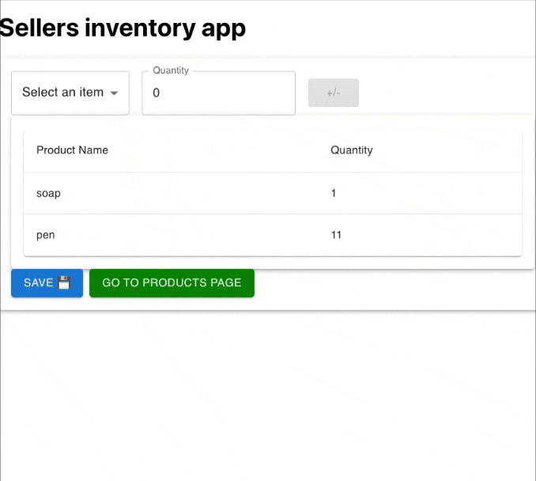
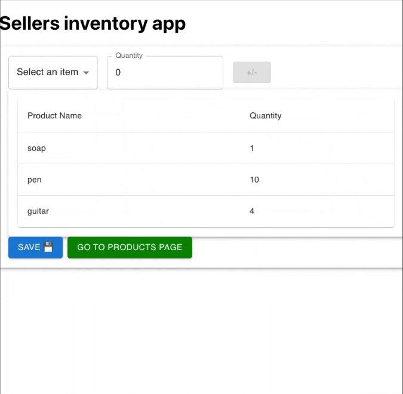

# store-inventory-client


## instructions

1. run npm install command

    ```js
    npm install
    ```
2. run npm start script
    ```js
    npm start
    ```
3. The application is ready at `localhost:3000`

## flows

### updating inventory:




### adding new products:

